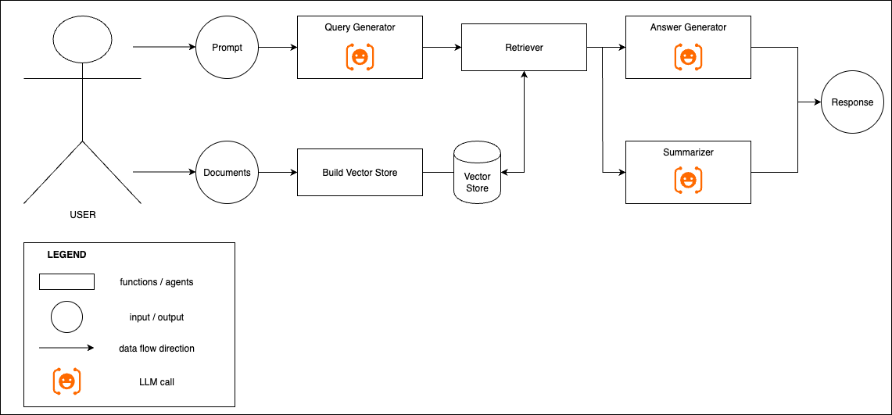
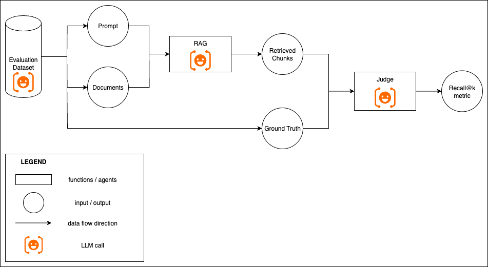

## Overview

This project implements a minimal Retrieval‑Augmented Generation (RAG) system with:
- A backend FastAPI service for store management, querying, and evaluation
- A lightweight Streamlit admin UI for uploading documents, building vector stores, running queries, and basic evaluation (recall/latency)

The aim is to demonstrate a clear, robust, and observable RAG pipeline with a minimal user experience for running experiments.

## Setup Instructions

1) Provide your OpenAI API key
- Create a `.env` file in the project root:
  ```bash
  echo "OPENAI_API_KEY=sk-..." > .env
  ```

2) Option A: Run tests then spin up containers
- Use the helper script:
  ```bash
  ./scripts/test_then_spin_up.sh
  ```

2) Option B: Spin up directly (skip tests)
- Build and start the backend and UI:
  ```bash
  docker compose up --build
  ```

3) Open the UI
- Go to `http://localhost:8501` (Streamlit UI)
- The backend API is at `http://localhost:8000` (FastAPI)

4) Cleanup
- When you’re done:
  ```bash
  docker compose down -v
  ```


## Using the Admin UI

This UI is intentionally minimal and designed as an admin panel. The primary goal is functionality and clarity, with simple guardrails to keep the user on the correct path.

- Core flow (minimal)
  1. Enter a Store ID in the sidebar.
  2. Upload one or more `.txt` files.
  3. Click “Build Vector Store.”
  4. Ask questions in the chat area (Increase top-k with the slider if an answer can't be found). 
  5. To start fresh, delete the vector store and return to step 1.
  6. Optional: In the Evaluation panel, run the built‑in retrieval accuracy test to see Mean/Std Recall and latency.

- Sample documents and quick questions
  - The `sample_documents/` set can include both publicly available texts and small LLM‑generated texts for quick testing. You can try the following examples:
  - Example (The Art of War — Sun Tzu) ([link](https://www.gutenberg.org/cache/epub/17405/pg17405.txt))  
    Q: What five constant factors govern the art of war, according to Sun Tzŭ?  
    A: “The Moral Law; Heaven; Earth; The Commander; Method and discipline.” (Chapter I, Laying Plans)  
    Q: What does Sun Tzŭ call “supreme excellence” in war?  
    A: “Breaking the enemy’s resistance without fighting.” (Chapter III, Attack by Stratagem)
  - Example (The Time Machine — H. G. Wells) ([link](https://www.gutenberg.org/cache/epub/35/pg35.txt))  
    Q: What is the name of the Eloi the Time Traveller rescues and befriends?  
    A: Weena.  
    Q: Who took the Time Machine, and where was it hidden?  
    A: The Morlocks took it and hid it inside the hollow bronze pedestal beneath the White Sphinx.
  - Example (Multiple files: `frogs.txt` + `giraffes.txt`)  
    Q: How tall a giraffe can be and how do frogs communicate?  
    A: Up to about 5.5 m tall, and frogs communicate with distinctive calls.

- Guardrails and UX safety
  - Store ID is required. Upload and Build buttons remain disabled until one is provided.
  - Delete‑before‑build: Building is disabled if a vector store under the same ID already exists.
  - Upload is disabled while a store exists; delete to change its contents.
  - Store ID locks after the first successful upload; it unlocks automatically after you delete the store.
  - Responses include tracing headers and the UI displays the search query used by retrieval to aid debugging.

- What you’ll see on the screen
  - Sidebar: API base URL, Store ID, upload control, Build and Delete actions, Top‑k slider.
  - Chat: ask questions about your documents and view answers.
  - Summaries: concise summaries of retrieved chunks; expandable raw text is available per chunk.
  - Metadata: embeddings model, prompt preview, retrieval strategy, and the rewritten search query.
  - Evaluation: run retrieval accuracy and see Mean/Std Recall, plus Mean/Std Latency.

## Architecture



This system consumes a user prompt (string) and a small set of plain‑text documents (`.txt` files) uploaded per vector store. It produces a structured response that includes:
- Answer: grounded answer text.
- Retrieved chunks: concise summaries with per‑chunk metadata (e.g., `source`, `chunk_index`, `score`).
- Metadata: retrieval/LLM details such as `embeddings_model`, `llm_model_*`, `retrieval_strategy`, `prompt_used_preview`, and the `rewritten_query` used for retrieval.
- Raw chunks (optional): the original chunk texts with metadata (returned only when explicitly requested).

## Components

### Build Vector Store
- Implemented by `vector_store.py` and `ingestion.py`.
- Loads `.txt` files under `data/stores/{store_id}`, chunks them, embeds with `text-embedding-3-small`, and stores in Chroma at `chroma_store_versions/{store_id}`.
- Chunking strategy: fixed-size character chunks with overlap to preserve context across boundaries.
  - Chunk size: 500 characters
  - Overlap: 50 characters
  - Rationale: simple, deterministic splitting that balances recall (overlap) and index size.

### Query Generator
- `query_generator.py` rewrites the user question into a concise, retrieval‑friendly query using an LLM (`gpt-4o-mini`).
- The original question is still used for answer generation; only retrieval uses the rewritten query.

### Retriever
- `retrieval.py` queries Chroma with `similarity_search_with_score` and converts Euclidean scores to cosine similarity, exposed in per‑chunk metadata.
- Cosine similarity is preferred because it is range of [−1, 1] makes it more intuitive. Moreover, the embedding model `text-embedding-3-small` returns unit norm vectors, therefore cosine and Euclidian scores carry the exact same information and can be converted to each other.

### Answer Generator
- `answer_generator.py` builds a grounded, cited answer with `gpt-4o`, requiring claims to be supported by retrieved chunks and adding (chunk index: N) citations.
- Prompt design: the LLM is instructed to ground answers strictly in retrieved chunks while still trying to infer the user’s intent.
- Trade‑off: strict grounding can make the model reluctant to answer slightly misframed questions.
   - Example: asking “How long a giraffe can be?” may be refused even if the chunks contain the information. The model expects the more correct form: “How tall a giraffe can be?”, due to conservative grounding.

### Summarizer
- `summarizer.py` produces concise 2–3 sentence summaries of each retrieved chunk using `gpt-4o-mini` (batched calls).

## Evaluation

Recall@k definition: For each question, recall@k is the fraction of expected information items (from a ground‑truth list) that are present within the top‑k retrieved chunks. If the ground truth lists M items and the judge finds m of them in the retrieved context, recall@k = m / M.

- 

- 1) Evaluation data generation
  - An LLM is used to produce an evaluation sample: a text, five questions about that text, and for each question a list of specific information items required to answer it.

- 2) RAG evaluation run
  - The RAG pipeline ingests the evaluation text and then answers the evaluation questions using the standard retrieval + generation flow.

- 3) LLM judge
  - A separate LLM judge checks, per question, which expected information items are present in the retrieved chunks (True/False per item).

- 4) Reporting
  - Performance is reported as recall@k (percentage) per question, and aggregated as mean recall across all questions. Latency metrics (mean/std) are also displayed in the UI.

## Further Improvements

How to evaluate and iterate in a real‑world setting:

- Metrics and procedures
  - Precision@k in addition to Recall@k to penalize irrelevant retrievals.
  - End‑to‑end evaluation over a ground‑truth dataset of (prompt, documents, final answer), scoring both retrieval and generation.
  - Hallucination evaluation: verify that final answers are supported by retrieved chunks.
  - Human‑in‑the‑loop review: sample a subset of interactions weekly for manual labeling (correctness, relevance, faithfulness) and use feedback to guide iteration.
  - Drift monitoring: track retrieval scores and answer quality over time as documents and models evolve.
  - Cost/latency SLOs: record p50/p95 latency and token/cost budgets.

- System improvements
  - Add a re‑ranker to reorder retrieved chunks before answer generation.
  - Integrate a hallucination checker post‑generation to ensure that the final answer is grounded on the retrieved chunks.
  - Fine‑tune or adapt the embedding model on domain corpora to improve retrieval recall/precision.
  - Prompt tuning: A/B test different prompts.
  - Query planning: add multi‑query expansion or iterative retrieval (self‑ask) for complex questions.
  - Observability: add dashboards for request rate, errors, latency, retrieval scores, and answer quality signals.

## Observability & Logging

This project emits structured JSON logs (see `logging_utils.py`) to provide end‑to‑end traceability and quick debugging.

- API request handling
  - `api.request.start` and `api.request.end`: include `request_id`, HTTP `method`, `path`, `status_code`, and `duration_ms`.
  - Response headers: `X-Request-ID` for correlation and `X-Response-Time-ms` for server processing latency.
  - Errors: `api.error` on both `HTTPException` and unhandled exceptions with `error_type`, `message`, `status_code`, `path`, and `request_id`.

- Retrieval results
  - `retrieval.results`: records the `retrieval_strategy`, `k`, and per‑result fields: `summary`, `source`, `chunk_index`, and similarity `score` (cosine) for transparency.
  - Retrieval failures: `retrieval.error` with `error_type`, `message`, and `persist_dir`.

- LLM prompt/response details
  - `llm.metadata`: captures `embeddings_model`, `answer_model`, `summarizer_model`, `query_model`, and a `prompt_preview` (first N chars).
  - `llm.answer`: logs an `answer` preview and total `length` (characters) for lightweight observability.

- Vector store operations
  - `vector_store.build.empty` when no chunks are produced from the uploaded data.
  - `vector_store.build.success` with `persist_dir` and `num_chunks`.

- Domain events
  - `api.query.success` on successful `/query` calls.
  - `api.store.created`, `api.store.deleted`, `api.store.exists` for store lifecycle operations.

## Error Handling & Fault‑tolerance

Implemented behaviors
- Input validation
  - Empty question -> 400 with `{ message, request_id }`.
  - Invalid `store_id` format -> 400.
  - Missing vector store -> 404.
  - Store already exists on build -> 409.
- Retrieval/model failures
  - Retrieval errors (`RetrievalError`) are mapped to 502 with structured error JSON and `api.error` log.
  - Other pipeline/LLM errors return 502 with structured error JSON.
- Consistent error contract
  - All errors include a `request_id` to correlate with logs; response headers set `X-Request-ID`.
  - Example error response:
    ```json
    { "message": "Vector store not found. Build it first.", "request_id": "<uuid>" }
    ```
- Request lifecycle
  - Middleware emits start/end logs with duration; headers include `X-Response-Time-ms` for server processing time.

How we’d strengthen in production
- Timeouts, retries, and backoff for external calls (LLM API, vector DB) with clear retry budgets.
- Rate limiting and input size limits to protect the service from abuse and runaway cost.
- Idempotent ingestion/build operations with job queues for large corpora; progress and resumability.
- Per‑store quotas and isolation to reduce blast radius.
- Shadow deployments/A‑B for prompt and retrieval changes; automatic rollback on SLO regression.
- Automated alerting (error rate, latency p95/p99, failure spikes) with dashboards.
- Persistent audit logs for admin actions (create/delete stores) and PII redaction pipeline if needed.

## Security Considerations

Current handling
- API keys via environment variables (e.g., `OPENAI_API_KEY`); not hard‑coded in the repo and not logged.
- UI does not require or use the API key. Only the backend needs the key.
- Error responses avoid leaking internal paths or stack traces; they include a `request_id` for correlation.
- CORS is permissive for local development. For deployment, restrict allowed origins via configuration.
- Uploads are restricted to `.txt`.

Recommended hardening for real‑world deployments
- Secret management: use a secrets manager (e.g., AWS Secrets Manager, GCP Secret Manager) or container/orchestrator secrets; avoid baking `.env` into images.
- AuthN/Z: protect admin endpoints (stores, uploads, deletes, eval) with authentication and role‑based authorization.
- Network and transport: enforce TLS, consider IP allowlists/VPN/private networking between UI and API.
- Input constraints: stricter size limits and MIME sniffing on uploads; request body size limits; robust validation for all inputs.
- Rate limiting and quotas: per‑IP and per‑API key limits; cost/budget guards for LLM calls.
- Data protection: encrypt vector store at rest (disk encryption) and documents at rest; consider separate storage per tenant.
- Logging hygiene: scrub PII/secrets from logs; set retention policies; centralize logs with access controls.
- CORS/CSRF: lock CORS to trusted origins; if cookies/session used, add CSRF protections.
- Auditability: maintain audit logs for store creation/deletion, uploads, and eval runs.

## Testing Requirements

What’s covered
- Retrieval correctness
  - `tests/test_retrieval_accuracy.py`: Uses an LLM judge over a small fixture to compute recall@k. Requires a real `OPENAI_API_KEY`.
  - UI also exposes an on-demand Evaluation panel that reports mean/std recall and latency.
- API endpoint functionality
  - `tests/test_api_endpoints.py`: Validates `/health` and `/query` happy path, checks tracing headers, and response structure. Stubs the pipeline (no real LLM calls).
- Error handling and edge cases
  - `tests/test_api_endpoints.py`: 400 empty question, 404 missing store, 502 retrieval failure (`RetrievalError`), and 502 generic pipeline failure. Ensures structured error body with `request_id`.
- Structure and basic integration
  - `tests/test_structure.py`: Import smoke tests.
  - `tests/test_rag_pipeline.py`: End-to-end build+pipeline sanity test over a temp store.

How to run
- Fast API tests (no real key required):
  - `python scripts/run_api_tests.py`
  - Or `pytest -q tests/test_api_endpoints.py`
- Full retrieval accuracy (requires real key):
  - `pytest -q tests/test_retrieval_accuracy.py`

Rationale
- API tests use a stubbed pipeline to be deterministic, fast, and key-free; they verify contract shape and error mapping.
- Retrieval accuracy uses a tiny fixture and an LLM judge to avoid maintaining human labels while still measuring recall.

Ideas for expanded testing in production
- Larger golden datasets with human-verified answers for end-to-end regression baselines (recall/precision/F1, answer correctness and faithfulness).
- Nonfunctional testing: load, soak, and chaos testing for latency/error resilience; vector DB failover drills.
- Contract tests for observability (required logs/headers present) and error contracts.
- Property-based testing of input validation and chunking edge cases.
- Canary/Shadow evaluation comparing prompt/reranker/embedding variants before rollout.

## Using AI Assistance

The code in this repository is produced with Cursor follwoing the template:

- Architect a solution → discuss the architecture with AI to refine it → let AI generate initial code → tweak, discuss, and test iteratively until it works.
- I reviewed AI‑generated code for correctness and clarity; adjusted implementations (e.g., structured logging, error mapping, request tracing), added tests, and refined prompts and metadata.